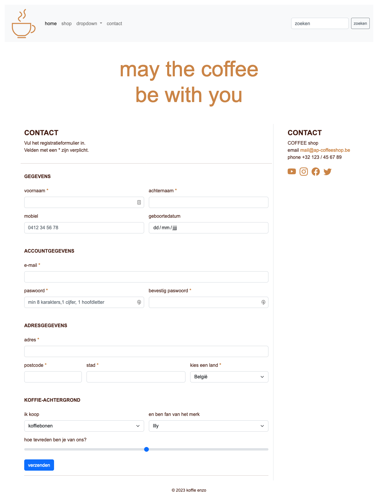
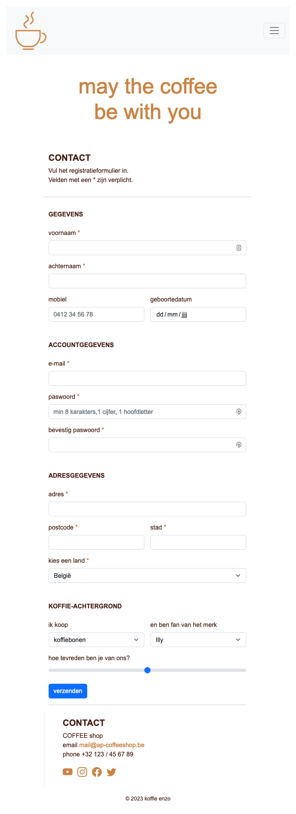
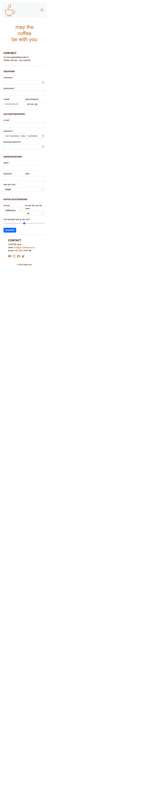

# 💻 LES: W5 - Bootstrap & Content - Oefening 01

## 🛠️ Opdrachten

### `index.html` openen

 - [ ] Open het bestand genaamd [`index.html`](index.html).

### `style.css` koppelen

- [ ] koppel de eigen css uit [`style.css`](css/style.css) aan de HTML.
    - `./css/style.css` en gebruik de klasse `themed-container` voor section

### Bekijk de Bootstrap Cheatsheet

- [ ] open de [bootstrap cheatsheet](https://getbootstrap.com/docs/5.2/examples/cheatsheet/). Gebruik de dev-tools van je browser om de elementen te inspecteren.
- [ ] Open de [bootstrap icons](https://icons.getbootstrap.com/). Klik op een icoontje om te leren hoe je het icoontje gebruikt op een Bootstrap webpagina.

### Voorbeeld Namaken

- [ ] Maak de printscreens zo goed mogelijk na.

#### Head

- [ ] voeg de `style.css` uit de map css toe

#### nav

- [ ] heeft een klasse navbar
- [ ] de navbar vergroot bij het breakpoint md
- [ ] de navbar heeft een lichte achtergrond
- [ ] div heeft een container van `100%` breed
- [ ] het logo `coffee.png` zit in een klasse navbar-brand
- [ ] alle list-items behoren tot de klasse nav-item en hebben een nav-link
- [ ] de dropdown heeft een klasse dropdown-menu met dropdown-items
- [ ] de button heeft een kleine button en heeft een grijze omtrek

#### header
- [ ] de header staat in een rij
- [ ] h1 heeft een kolom, een gecentreerde tekst en een koffiebruine kleur  
_(tip: zie ./css/style.css)_

#### main
- [ ] heeft een klasse col met breakpoint md die 9 fracties omvat
- [ ] het artikel heeft een klasse col met 12 fracties, en een marge onderaan van 3
- [ ] de ondertitel (h2) staat in hoofdletters, heeft een font-size 4, de font-weight is bolder en heeft een padding-top van 3
- [ ] alle 6 artikels met klasse shop-items zijn bij minder dan 576px 12 fractie breed, bij het breakpoint sm zijn ze 6 fracties breed, en bij md 4 fracties
- [ ] de h2 van het shop-item staat in hoofdletters, heeft een font-size 6, de font-weight is bolder en heeft een padding-top van 3
- [ ] de afbeelding binnen de figure zijn responsief
- [ ] de figcaption heeft een klasse kleine h6 en een marge bovenaan van 2

#### aside
- [ ] heeft een klasse col met een breakpoint md met 3 fracties
- [ ] h2 van contact heeft dezelfde klasse als h2 shop
- [ ] de list-items staan inline
- [ ] de iconen hebben een font-size van 3 en een koffiebruine kleur

#### footer
- [ ] de container is 100% breed en heeft een padding van 4
- [ ] de tekst in gecentreerd
- [ ] de tekst heeft een kleine h6

#### screenshots

